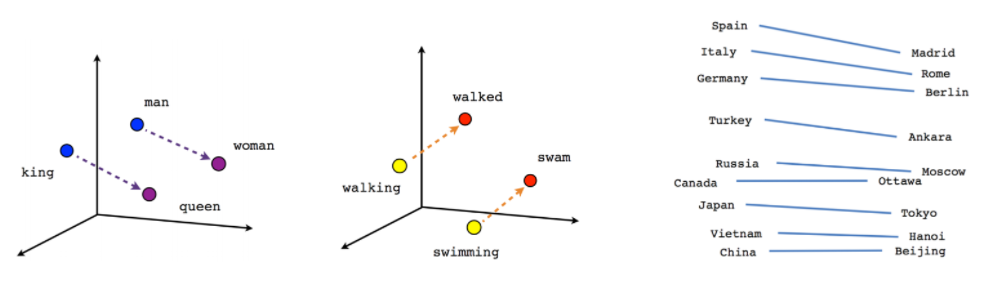

# Teste de arquivo markdown (.md) feito no Microsoft Word.

Lista numérica:

1.  Item

Lista não numérica:

-   Item

Destaques: *itálico*, **negrito**, sublinhado, hachurado

Nota de rodapé [^1]

[^1]: Nota de rodapé

Margem:

“Esta é uma citação”

Hyperlink: <https://www.google.com/>

Bloco de código

Tabela

| Estado    | Capital   |
|-----------|-----------|
| São Paulo | São Paulo |

Figura

